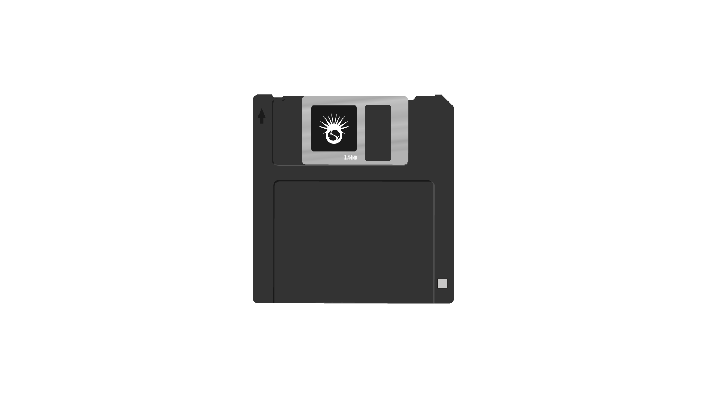

<!DOCTYPE html>
<html lang="en">
  <head>
    <!-- Required meta tags -->
    <meta charset="utf-8">
    <meta name="viewport" content="width=device-width, initial-scale=1">

    <!-- Bootstrap CSS -->
    <link href="https://cdn.jsdelivr.net/npm/bootstrap@5.0.0-beta2/dist/css/bootstrap.min.css" rel="stylesheet" integrity="sha384-BmbxuPwQa2lc/FVzBcNJ7UAyJxM6wuqIj61tLrc4wSX0szH/Ev+nYRRuWlolflfl" crossorigin="anonymous">
    <link rel="stylesheet" href="https://pro.fontawesome.com/releases/v5.10.0/css/all.css" integrity="sha384-AYmEC3Yw5cVb3ZcuHtOA93w35dYTsvhLPVnYs9eStHfGJvOvKxVfELGroGkvsg+p" crossorigin="anonymous"/>
    <link rel="stylesheet" href="assets/css/style.css">
    <link rel="stylesheet" href="">
    <title>Скоморохи</title>
  </head>
  <body>

    <!--  Header  -->
    <header class="header" id="header">
      

        <nav>
          

          <ul class="nav">
            <li><a href="Listen/listen.html">Слушать</a></li>
            <li><a href="#">Смотреть</a></li>
            <li><a href="#">Скачать</a></li>
            <li><a href="#" data-scroll="#feedback">Связаться</a></li>
          </ul>
        </nav>

        <!-- <button class="header_btn"> -->
        	<i class="fas fa-chevron-down"></i>
       <!--  </button> -->
      

    </header>

    <!--  Post  -->
    <section class="post" id="post">
      

      	

      		

      			<a href="#">
      				<!--  -->
      				
      			</a>
      		

      		

      			
      		

      		

      			
      		

      	

      	<!--  Cont_post  -->
        

          

            

            
Категория

            
Заголовок поста-Заголовок поста

            
Текст поста Текст поста Текст поста Текст постаТекст поста Текст поста

            
01.01.2021

          

          

             

            
Категория

            
Заголовок поста-Заголовок поста

            
Текст поста Текст поста Текст поста Текст постаТекст поста Текст поста

            
01.01.2021

          

          

            
Музыкальная секта   из России

            
            
Вступить в секту?

            <input type="email" placeholder="email">
          

        

         

          

            

            
Категория

            
Заголовок поста-Заголовок поста

            
Текст поста Текст поста Текст поста Текст постаТекст поста Текст поста

            
01.01.2021

          

          

             

            
Категория

            
Заголовок поста-Заголовок поста

            
Текст поста Текст поста Текст поста Текст постаТекст поста Текст поста

            
01.01.2021

          

          

            
Наши сети

            

            

            

            
          

        

         

          

            

            
Категория

            
Заголовок поста-Заголовок поста

            
Текст поста Текст поста Текст поста Текст постаТекст поста Текст поста

            
01.01.2021

          

          

             

            
Категория

            
Заголовок поста-Заголовок поста

            
Текст поста Текст поста Текст поста Текст постаТекст поста Текст поста

            
01.01.2021

          

          

            
Связаться

            <form action="">
            	<input type="text" placeholder="Имя">
            	<input type="email" placeholder="e-mail">
            	<textarea name="#" id="#" cols="30" rows="10" placeholder="Сообщение"></textarea>
            </form>
          

        

        

        	<a href="#">Дальше</a>
        	<a href="#" class="back">Назад</a>
        

      

    </section>

    <!--  Footer  -->
    <footer class="footer" id="footer">
    	

    		
    		
skomorohi.com

    		

    		

    		

    		
    	

    </footer>

    
    
    
  </body>
</html>
